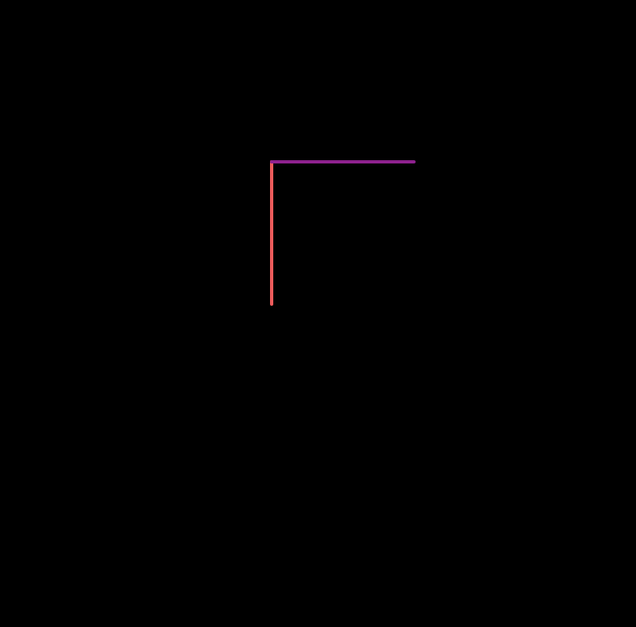
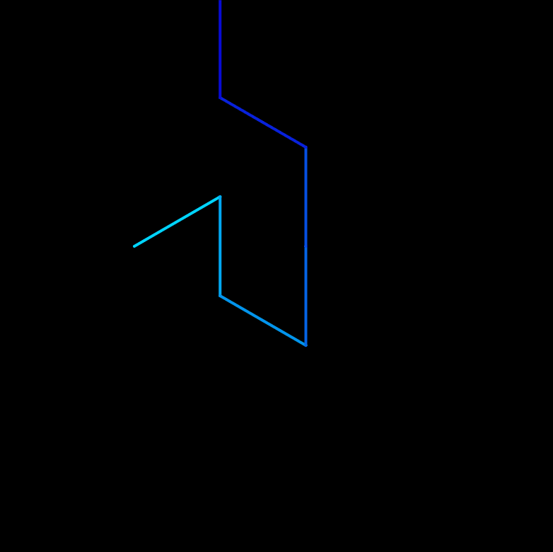
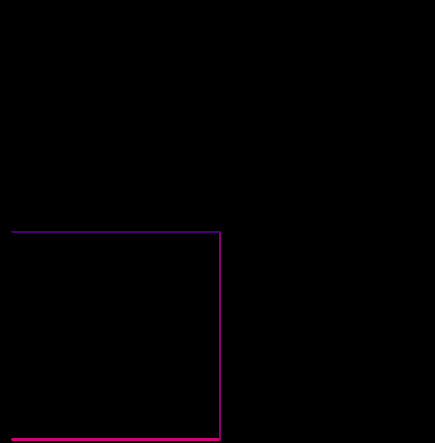
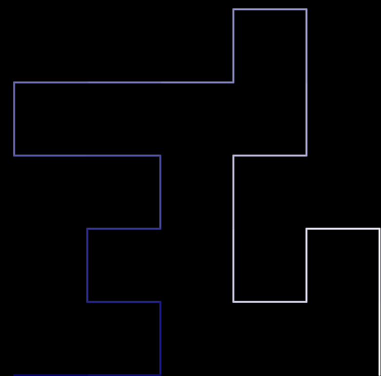
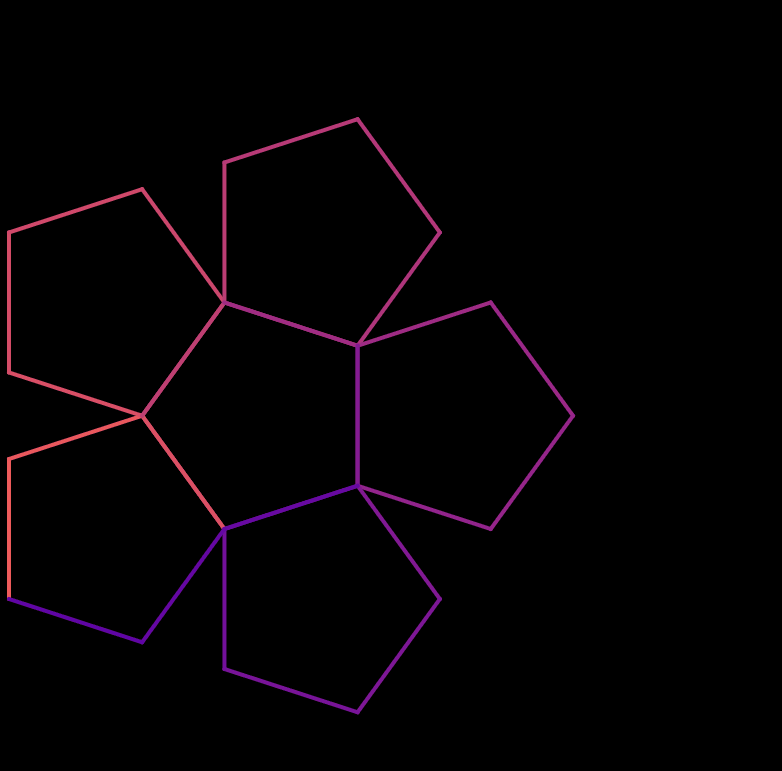
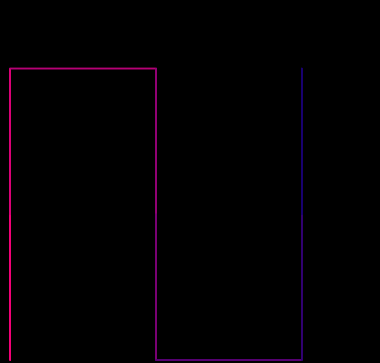
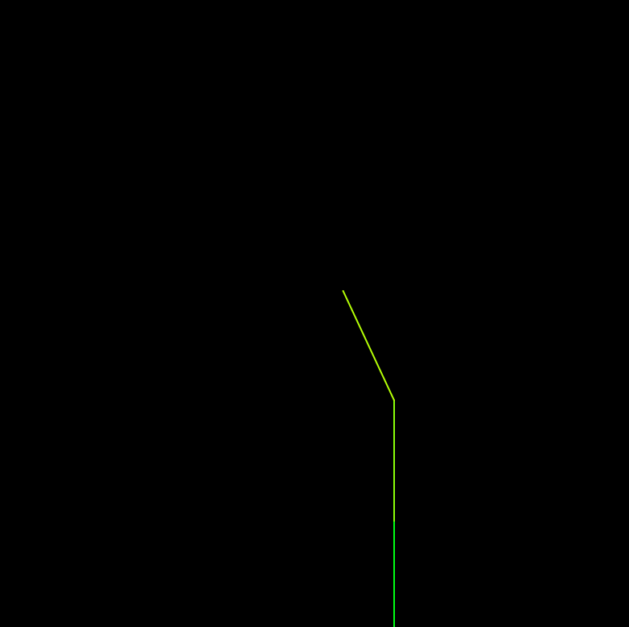
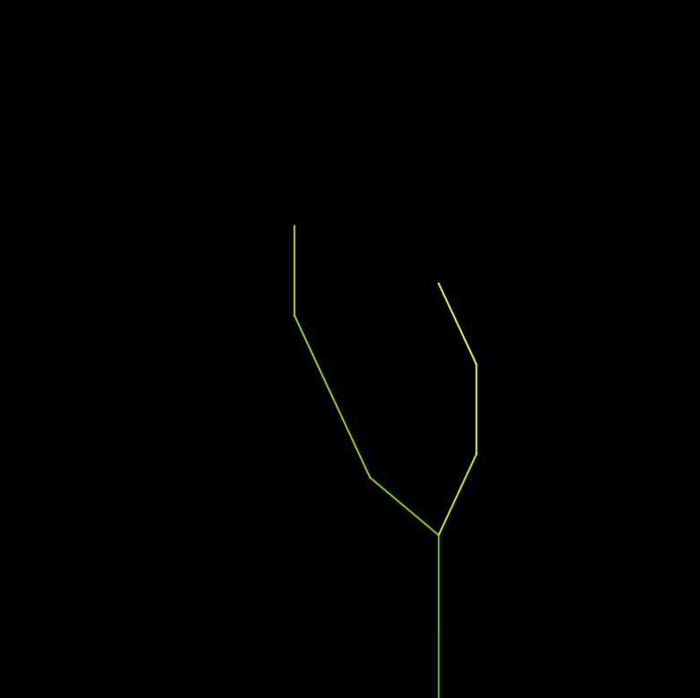

# L-system Generator

This is a very simple L-system generator, you can use it to create and experiment designs and patterns.

## Usage

An L-system is a formal grammar consisting of 4 parts:

- **Variables**: Symbols that can be replaced by production rules. In our generator, we currently only have 3 variables.
- **Constants**: Symbols that do not get replaced. The constants are any of the following symbols: [, ], +, -.
- **Axiom** : A string composed of some number of variables and/or constants. The axiom is the initial state of the system.
- **Production rules** : Define the way variables can be replaced with combinations of constants and other variables. A production consists of two strings - the predecessor and the successor.

The alphabet section should explain the variables and constants we have in this application currently.

----

#### Alphabet
The alphabet of the L System is currently pre-defined. 

**Variables**
- F : move forward
- X and Y : add complexity

**Constants**
- '+' : Turn right or rotate a positive angle.
- '-' : Turn left or rotate a negative angle.
- '[' : save (push) current orientation
- ']' : go back (pop) to older orientation

-------
#### Editables
       
**Factor** : 
A value between 0-1. As an L-system grows, so does its size. Adjust the value to fit your pattern into the canvas.

**Axiom** :
A string composed of some number of variables and/or constants. The axiom is the initial state of the system. You'll notice that changing the axiom can often lead to  entirely different patterns and is the base for your entire l-system. You can use any of variables and constants in your axiom.

**Rules** :
They define the way variables can be replaced with combinations of constants and other variables. A production consists of two strings - the predecessor and the successor. 
In each iteration, the rule is applied to the existing sentence. The first sentence is always the axiom itself.
The predecessor is the variable that the transformation will be applied to. The successor is the transformation itself.

For example : F = F+F+F+F+. Here, each F becomes F+F+F+F+ in every iteration.

This application can currently take up-to **2** user defined rules.

**StartX and StartY** :
Sets the starting point of the curve/pattern on the canvas.

**Iterations** :
Number of iterations of the curve/pattern. As one might guess, more the number of iterations, greater the complexity. 

**Length, Angle, Thickness, Starting shade, Ending shade** and **Background Color** are other parameters you can edit to help you create visually pleasing patterns using L-Systems.

----

### Examples

A list of existing patterns and designs are present in the web page already. These include popular curves like :

#### Dragon Curve

#### Gosper Curve

#### Hilbert Curve

#### Maze-y thing

#### Pentaplex

#### Peano Curve

#### Plant

#### Tree

